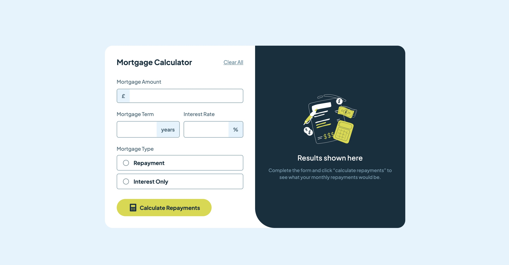
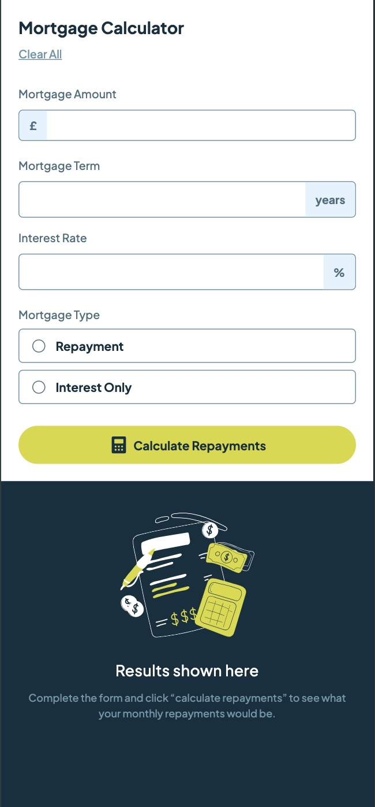

# Mortgage-Repayment-Calculator-Design

## Table of contents

- [Overview](#overview)
  - [The challenge](#the-challenge)
  - [Screenshot](#screenshot)
  - [Links](#links)
- [My process](#my-process)
  - [Built with](#built-with)
  - [What I learned](#what-i-learned)
  - [Continued development](#continued-development)
- [Author](#author)


## Overview

### The challenge

Users should be able to:

- Input mortgage information and see monthly repayment and total repayment amounts after submitting the form
- See form validation messages if any field is incomplete
- Complete the form only using their keyboard
- View the optimal layout for the interface depending on their device's screen size
- See hover and focus states for all interactive elements on the page

### Screenshot





### Links

- Solution URL: [F.M Solution](https://www.frontendmentor.io/solutions/mortgage-repayment-calculator-solution-QFwagdMEyd)
- Live Site URL: [Github!](https://clipzorama.github.io/Mortgage-Repayment-Calculator-Design/)

## My process

### Built with

- Semantic HTML5 markup
- CSS custom properties
- Flexbox
- CSS Grid
- Mobile-first workflow


### What I learned

Working on this project taught me numerous valuable skills in JavaScript, CSS, and form validation. Some of the points below are some of the significant takeaways that enhanced my understanding and problem-solving abilities from this design:

- **Dynamic DOM Manipulation:** Using classList methods for responsive design changes and making sure to reference it from CSS classes.

- **Custom Validation Logic:** Implementing manual validation logic for type="text" inputs without relying solely on native browser validation.

**Currency Formatting:** Using **Intl.NumberFormat** to elegantly display currency values for user-friendly output.

**Error Handling & DevTools:** Explored DevTools features such as breakpoints, DOM manipulation, and live CSS editing to refine the design and functionality.


```html
<!-- for the mortgage term and interest rate inputs -->

<section class="term-rate">
    <div class="term-section">
        <label for="mortgage-term">Mortgage Term</label>
        <div class="input-term">
            <input type="text" id="mortgage-term" name="mortgage-term" required>
            <span class="input-year">years</span>
        </div>

    </div>

    <div class="interest-section">
        <label for="interest-rate">Interest Rate</label>
        <div class="input-interest">
            <input type="text" id="interest-rate" name="interest-rate" required>
            <span class="input-percent">%</span>
        </div>
    </div>
</section>
```

```css
.interest>input[type="radio"] {
    appearance: none;
    width: 15px;
    height: 15px;
    border: 1px solid var(--Slate-700);
    border-radius: 50%;
    background-color: white;
    cursor: pointer;
}

.interest>input[type="radio"]:checked {
    border: 1px solid var(--Lime);
}

.interest>input[type="radio"]::after {
    content: "";
    width: 10px;
    height: 10px;
    border-radius: 50%;
    background-color: var(--Lime);
    position: relative;
    top: 50%;
    left: 49%;
    transform: translate(-50%, -50%);
    display: none;
}
```

```js
if (repaymentInput) {
        let monthlyRate = interestRate / 12 / 100;
        let totalMonths = termValue * 12;
        monthlyPayment = mortgage_value * (monthlyRate * Math.pow(1 + monthlyRate, totalMonths)) / (Math.pow(1 + monthlyRate, totalMonths) - 1);
        totalPayment = monthlyPayment * totalMonths;

    } else if (interestInput) {
        let monthlyRate = interestRate / 12 / 100;
        monthlyPayment = mortgage_value * monthlyRate;
        let totalMonths = termValue * 12;
        let totalInterest = monthlyPayment * totalMonths;
        totalPayment = totalInterest + mortgage_value;
    }

    // this formatter is to add the commas in their respected areas
    const formatter = new Intl.NumberFormat('en-GB', {
        style: 'currency',
        currency: 'GBP',
        minimumFractionDigits: 2, // Ensures two decimal places
    });


    resultPending.style.display = "none";
    resultDiv.style.display = "flex";

    monthPlan.textContent = `${formatter.format(monthlyPayment)}`;
    overTerm.textContent = `${formatter.format(totalPayment)}`;
```


### Continued development

- **Dark Mode:** Implement a toggle for light and dark modes.
- **Backend Integration:** Allow saving and retrieving calculations with a backend database. Perhaps if I made profiles for users so they can have their information stored for future reference.
- **Multi-Currency Support:** Add options to calculate payments in different currencies so it can be utilized by anyone despite individuals familiar with **£** Currency
- **Dynamic Charts:** I am familiar with using charts and I think it would be awesome to display a breakdown of payments using a pie or line chart. For individuals who are more efficent through visual depictions, this would be most beneficial to them.


## Author

- Frontend Mentor - [@Clipzorama](https://www.frontendmentor.io/profile/Clipzorama)

